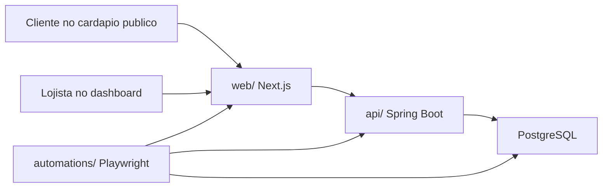

# MeVeUm

Sistema operacional para restaurantes: cardapio digital publico, checkout com
WhatsApp, painel administrativo, CRM, pedidos, pagamentos, entregas e metricas.

Este repositorio e um monorepo com tres partes principais:

- `api/` - backend Spring Boot, banco PostgreSQL e regras de negocio.
- `web/` - frontend Next.js, painel administrativo e cardapio publico.
- `automations/` - Playwright para contratos de API, fluxos de frontend e E2E.

Os detalhes tecnicos ficam nos READMEs de cada pasta. Este arquivo e o mapa do
projeto e o caminho mais curto para subir tudo localmente.

## Arquitetura



## Estrutura

```text
meveum/
|-- api/                 Backend, migrations Flyway e modelo de dados
|-- web/                 Frontend Next.js
|-- automations/         Testes Playwright
|-- .github/workflows/   CI e automacoes
|-- CONTRIBUTING.md      Fluxo de contribuicao
`-- README.md            Visao geral do monorepo
```

## Pre-requisitos

- Java 21
- Node.js 20+
- npm 10+
- Docker e Docker Compose
- GitHub CLI (`gh`) apenas para operacoes de PR/release

## Como iniciar localmente

Abra tres terminais: banco/API, web e automacoes.

### 1. Banco

```bash
cd api
docker compose up -d
```

PostgreSQL local:

| Campo | Valor |
|---|---|
| Host | `127.0.0.1` |
| Porta | `5432` |
| Database | `meveum` |
| Usuario | `meveum` |
| Senha | `meveum` |

### 2. API

Windows:

```powershell
cd api
.\mvnw.cmd spring-boot:run
```

Linux/macOS:

```bash
cd api
./mvnw spring-boot:run
```

URLs:

- API: `http://localhost:8080`
- Swagger UI: `http://localhost:8080/swagger-ui.html`
- OpenAPI JSON: `http://localhost:8080/v3/api-docs`

### 3. Web

```bash
cd web
npm ci
cp .env.local.example .env.local
npm run dev
```

No Windows PowerShell:

```powershell
cd web
npm ci
Copy-Item .env.local.example .env.local
npm run dev
```

URL:

- Web: `http://localhost:3000`

### 4. Automacoes

Com API e web rodando:

```bash
cd automations
npm ci
npx playwright install chromium
npm test
```

Tambem e possivel rodar por camada:

```bash
npm run test:api
npm run test:frontend
npm run test:e2e
```

## Testes principais

```bash
cd api && ./mvnw test
cd web && npm test
cd web && npm run build
cd automations && npm test
```

No Windows, use `.\mvnw.cmd test` dentro de `api/`.

## Banco de dados

O schema e versionado por Flyway em
`api/src/main/resources/db/migration/`.

Estado atual:

- migrations de `V1` a `V13`;
- PostgreSQL 16;
- `ddl-auto=validate`;
- 16 tabelas de aplicacao;
- dados locais de desenvolvimento criados pelas migrations de seed.

Resumo dos grupos:

| Grupo | Tabelas |
|---|---|
| Loja e auth | `stores`, `store_users`, `password_reset_tokens` |
| Operacao da loja | `store_opening_periods`, `store_delivery_zones`, `store_payment_methods` |
| Catalogo | `categories`, `products`, `complement_groups`, `complement_options`, `product_complement_groups` |
| CRM | `customers`, `customer_addresses` |
| Pedidos | `orders`, `order_items`, `order_item_complements` |

Detalhes tecnicos, diagrama ER e historico de migrations ficam em
[`api/README.md`](api/README.md) e
[`api/docs/database-model.md`](api/docs/database-model.md).

## CI

O repositorio tem dois workflows:

- `CI` - roda testes da API, testes da web e build do Next.js.
- `Automations` - sobe PostgreSQL, API, web buildada e roda Playwright.

Checks obrigatorios na `main`:

- `API - testes`
- `Web - testes e build`
- `Playwright - integracoes`

## Documentacao por modulo

| Documento | Quando usar |
|---|---|
| [`api/README.md`](api/README.md) | Arquitetura backend, endpoints, banco, migrations e testes Java |
| [`web/README.md`](web/README.md) | Rotas, estrutura Next.js, API client, validacoes e testes Vitest |
| [`automations/README.md`](automations/README.md) | Metricas, padroes Playwright, tags, fixtures, services e relatorios |
| [`api/dados/README.md`](api/dados/README.md) | IDs fixos de desenvolvimento e collection Postman |
| [`CONTRIBUTING.md`](CONTRIBUTING.md) | Fluxo Git, commits e PRs |

## Rotina recomendada

1. Atualize a `main`.
2. Crie uma branch por contexto.
3. Rode a menor suite que prova a mudanca.
4. Se mexer em contrato compartilhado, rode API, web e automacoes afetadas.
5. Abra PR com resumo, riscos e test plan.

```bash
git checkout main
git pull
git checkout -b feature/minha-mudanca
```
