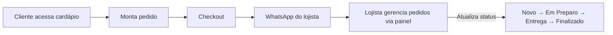
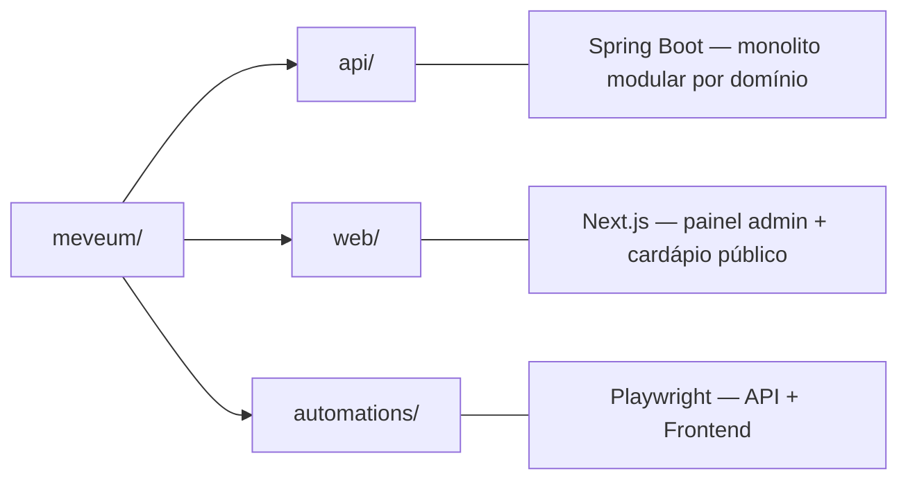
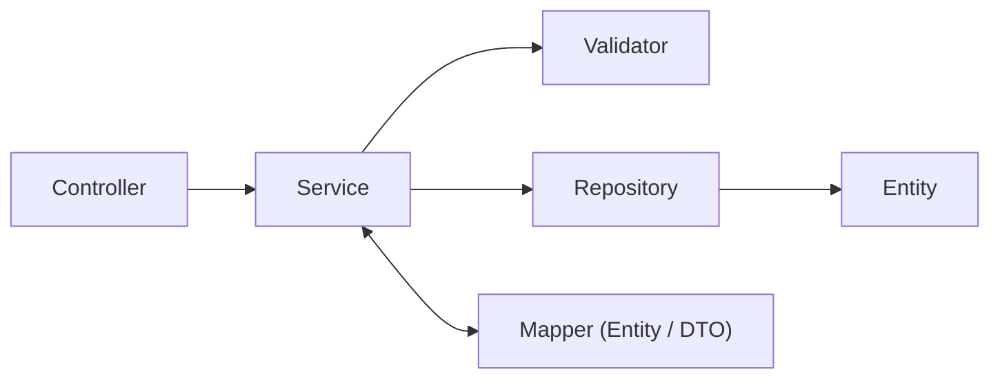
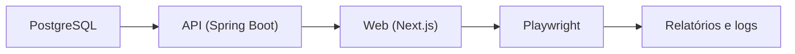

# MeVêUm

Sistema operacional para restaurantes — cardápio digital, checkout via WhatsApp, gestão de pedidos e painel administrativo para lojistas.

O MeVêUm oferece uma solução completa para que donos de restaurantes gerenciem seu cardápio online, recebam pedidos e administrem toda a operação a partir de um único painel.

## Índice

- [Visão geral](#visão-geral)
- [Arquitetura](#arquitetura)
- [Tecnologias](#tecnologias)
- [Estrutura do repositório](#estrutura-do-repositório)
- [Pré-requisitos](#pré-requisitos)
- [Como rodar](#como-rodar)
- [Domínios e funcionalidades](#domínios-e-funcionalidades)
- [Modelo de dados](#modelo-de-dados)
- [CI/CD](#cicd)
- [Testes](#testes)
- [Documentação interna](#documentação-interna)
- [Contribuindo](#contribuindo)

---

## Visão geral

O MeVêUm é uma plataforma multi-tenant onde cada loja possui:

- Cardápio digital público acessível via slug (`meveum.com.br/sua-loja`)
- Checkout com envio para WhatsApp do lojista
- Painel administrativo para gestão de cardápio, pedidos, clientes, entregas, pagamentos e métricas
- Autenticação JWT com chaves RSA para segurança das rotas administrativas

### Fluxo principal



---

## Arquitetura

O projeto é um monorepo dividido em três módulos independentes:



### Backend — monolito modular

O backend segue a arquitetura de monolito modular organizado por domínios, com separação clara de responsabilidades:



Cada domínio possui controllers, services, validators, mappers, DTOs, entities e repositories próprios. Código compartilhado fica centralizado em `shared/`.

### Frontend — organização por features

O frontend segue uma organização modular por features com separação de:

- **Pages** — telas completas
- **Components** — UI reutilizável
- **Services** — comunicação com API
- **Hooks** — lógica reutilizável de tela
- **Mocks** — dados simulados por domínio
- **Types** — contratos de dados (espelhando DTOs do backend)

---

## Tecnologias

### Backend (`api/`)

| Tecnologia | Versão | Propósito |
|---|---|---|
| Java | 21 | Linguagem |
| Spring Boot | 4.0.6 | Framework principal |
| Spring Data JPA | — | Persistência |
| Spring Security + OAuth2 Resource Server | — | Autenticação JWT (RSA) |
| Spring Validation | — | Validação de dados |
| Flyway | — | Migrações de banco |
| PostgreSQL | 16 | Banco de dados |
| Lombok | — | Redução de boilerplate |
| SpringDoc OpenAPI | 3.0.2 | Documentação Swagger |
| Testcontainers | — | Testes com banco real |

### Frontend (`web/`)

| Tecnologia | Versão | Propósito |
|---|---|---|
| Next.js | 16.2.6 | Framework React |
| React | 19.2.4 | Biblioteca UI |
| TypeScript | 5.x | Tipagem estática |
| Tailwind CSS | 4.x | Estilização |
| Radix UI | — | Componentes acessíveis (Dialog, Select, Tabs, Toast, etc.) |
| React Hook Form + Zod | — | Formulários com validação |
| Lucide React | — | Ícones |
| Sonner | — | Notificações toast |
| Vitest + Testing Library | — | Testes unitários |

### Automações (`automations/`)

| Tecnologia | Versão | Propósito |
|---|---|---|
| Playwright | 1.60+ | Automação de testes |
| JavaScript (ESM) | — | Linguagem dos testes |

### Infraestrutura

| Tecnologia | Propósito |
|---|---|
| Docker Compose | PostgreSQL local |
| GitHub Actions | CI/CD |

---

## Estrutura do repositório

```
meveum/
├── .github/
│   └── workflows/
│       ├── ci.yml                 CI: testes da API e build da web
│       └── automations.yml        Integração: Playwright com API + Web
│
├── api/                           Backend Spring Boot
│   ├── src/main/java/br/com/meveum/
│   │   ├── auth/                  Autenticação e autorização (JWT)
│   │   ├── cardapio/              Categorias, produtos e complementos
│   │   ├── crm/                   Clientes e endereços
│   │   ├── dashboard/             Métricas e analytics
│   │   ├── entrega/               Áreas e taxas de entrega
│   │   ├── integracao_whatsapp/   Integração WhatsApp
│   │   ├── lojas/                 Gestão de lojas (tenant)
│   │   ├── pagamentos/            Formas de pagamento
│   │   ├── pedidos/               Pedidos e status
│   │   └── shared/                Config, exceções, validadores comuns
│   ├── src/main/resources/
│   │   ├── db/migration/          Migrações Flyway (V1..V9)
│   │   ├── authz.pem / authz.pub Chaves RSA para JWT
│   │   └── application.properties
│   ├── docs/
│   │   ├── database-model.md      Modelo de dados completo
│   │   └── rf.md                  Requisitos funcionais
│   ├── docker-compose.yml         PostgreSQL 16 Alpine
│   └── pom.xml
│
├── web/                           Frontend Next.js
│   ├── src/
│   │   ├── app/
│   │   │   ├── (auth)/            Login e cadastro
│   │   │   ├── (dashboard)/       Painel administrativo
│   │   │   ├── [slug]/            Cardápio público por loja
│   │   │   └── page.tsx           Landing page
│   │   ├── components/            UI, layout e componentes compartilhados
│   │   ├── features/              Domínios (auth, cardápio, pedidos, etc.)
│   │   ├── lib/                   API client, mocks, utils, validações
│   │   ├── tests/                 Testes unitários
│   │   └── types/                 Tipos compartilhados
│   └── package.json
│
├── automations/                   Testes de integração
│   ├── tests/
│   │   ├── api/                   Testes de contrato e integração API
│   │   └── frontend/              Testes de comportamento no browser
│   ├── pages/                     Page Objects
│   ├── services/                  Clients HTTP para testes
│   ├── fixtures/                  Setup/teardown e injeção de dados
│   ├── presets/                   Estados reutilizáveis de teste
│   ├── data/                      Massa de dados
│   └── playwright.config.js
│
├── CONTRIBUTING.md                Guia de contribuição e padrões Git
└── .gitignore
```

---

## Pré-requisitos

- Java 21+
- Maven 3.8+ (ou usar o Maven Wrapper incluso: `./mvnw`)
- Node.js 20+
- npm 10+
- Docker e Docker Compose

---

## Como rodar

### 1. Clonar o repositório

```bash
git clone https://github.com/Asimpta/meveum.git
cd meveum
```

### 2. Subir o banco de dados

```bash
cd api
docker-compose up -d
```

Isso inicia um PostgreSQL 16 com:

| Parâmetro | Valor |
|---|---|
| Database | `meveum` |
| User | `meveum` |
| Password | `meveum` |
| Porta | `5432` |

### 3. Rodar o backend

```bash
cd api
./mvnw spring-boot:run        # Linux/macOS
mvnw.cmd spring-boot:run      # Windows
```

A API estará disponível em `http://localhost:8080`.

Swagger UI: `http://localhost:8080/swagger-ui.html`

### 4. Rodar o frontend

```bash
cd web
cp .env.local.example .env.local
npm install
npm run dev
```

O frontend estará disponível em `http://localhost:3000`.

### 5. Rodar os testes de integração (opcional)

```bash
cd automations
npm install
npx playwright install --with-deps chromium
npm test
```

Os testes de integração requerem que a API e o frontend estejam rodando.

---

## Domínios e funcionalidades

### Gestão da loja (tenant)

- Cadastro e configuração da loja (nome, logo, slug, WhatsApp)
- Grade de horário de funcionamento (múltiplos períodos por dia)
- Botão de pausa manual
- Multi-tenancy: cada loja é um tenant isolado

### Catálogo / cardápio

- CRUD de categorias com ordenação
- CRUD de produtos (nome, descrição, preço, imagem, categoria)
- Grupos de complementos com regras de mínimo/máximo
- Opções de complemento com preço adicional
- Vinculação N:N entre produtos e grupos de complemento

### Entrega

- Áreas de entrega por bairro, faixa de CEP ou raio (km)
- Taxa de entrega e pedido mínimo por zona
- Tempo estimado de entrega

### Pagamentos

- Configuração de formas aceitas: PIX, cartão na entrega, dinheiro
- Ativação/inativação por loja

### CRM / clientes

- Cadastro e consulta de clientes
- Endereços do cliente (múltiplos)

### Pedidos

- Criação de pedido com cálculo automático de totais
- Validação de loja aberta, produtos ativos e complementos válidos
- Status: Novo, Em Preparo, Saiu para Entrega, Finalizado, Cancelado
- Snapshot de dados no pedido (protege contra alterações futuras no cardápio)

### Dashboard

- Faturamento total
- Quantidade de pedidos
- Produtos mais vendidos

### Integração WhatsApp

- Geração de mensagem estruturada com dados do pedido
- Envio direto via WhatsApp Web/App

### Autenticação

- Login e cadastro de usuários da loja (JWT com RSA)
- Proteção de rotas administrativas
- Endpoints públicos do cardápio liberados

---

## Modelo de dados

O banco utiliza 15 tabelas com multi-tenancy por `store_id`:

| Grupo | Tabelas |
|---|---|
| Loja | `stores`, `store_users`, `store_opening_periods`, `store_delivery_zones`, `store_payment_methods` |
| Catálogo | `categories`, `products`, `complement_groups`, `complement_options`, `product_complement_groups` |
| Clientes | `customers`, `customer_addresses` |
| Pedidos | `orders`, `order_items`, `order_item_complements` |

As migrações Flyway estão em `api/src/main/resources/db/migration/` (V1 até V9).

Documentação completa do modelo: [`api/docs/database-model.md`](api/docs/database-model.md)

---

## CI/CD

O projeto possui dois pipelines no GitHub Actions:

### CI (`ci.yml`)

Roda em push e pull request para `main`:

- **API** — compila e roda testes com Maven
- **Web** — instala dependências, roda testes com Vitest e valida build

### Automations (`automations.yml`)

Roda em push e pull request quando há alterações em `api/`, `web/` ou `automations/`:



---

## Testes

### Testes unitários — API

```bash
cd api && ./mvnw test
```

- Testcontainers com PostgreSQL real
- Cobertura de services, validators e mappers

### Testes unitários — Web

```bash
cd web && npm test
```

- Vitest + Testing Library
- Testes de comportamento (nunca estéticos)
- Cobertura de componentes, hooks e services

### Testes de integração — automações

```bash
cd automations && npm test
```

- **API** (`npm run test:api`): contratos, autenticação, CRUD e fluxos
- **Frontend** (`npm run test:frontend`): comportamento observável no browser
- Tags disponíveis: `@smoke`, `@regressao`, `@negativo`, `@contrato`

---

## Documentação interna

| Documento | Descrição |
|---|---|
| [`api/AGENTS.md`](api/AGENTS.md) | Padrões de arquitetura do backend |
| [`web/AGENTS.md`](web/AGENTS.md) | Padrões de arquitetura do frontend |
| [`automations/AGENTS.md`](automations/AGENTS.md) | Estratégia e padrões de automação |
| [`api/docs/database-model.md`](api/docs/database-model.md) | Modelo de dados completo com diagrama ER |
| [`api/docs/rf.md`](api/docs/rf.md) | Requisitos funcionais (RF01 a RF24) |
| [`CONTRIBUTING.md`](CONTRIBUTING.md) | Guia de contribuição, GitFlow e Conventional Commits |

---

## Contribuindo

O projeto segue GitFlow com Conventional Commits. Consulte o guia completo em [`CONTRIBUTING.md`](CONTRIBUTING.md).

```bash
git checkout main && git pull
git checkout -b feature/sua-funcionalidade

# Desenvolva...
git commit -m "feat: sua funcionalidade"
git push origin feature/sua-funcionalidade

# Abra um Pull Request → Code Review → Merge
```
