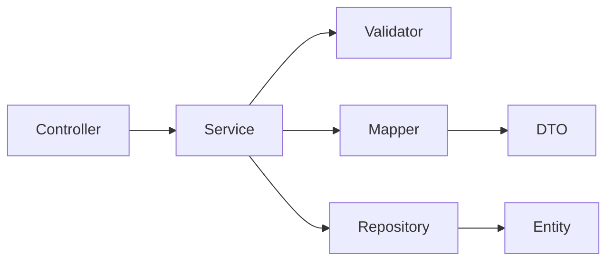
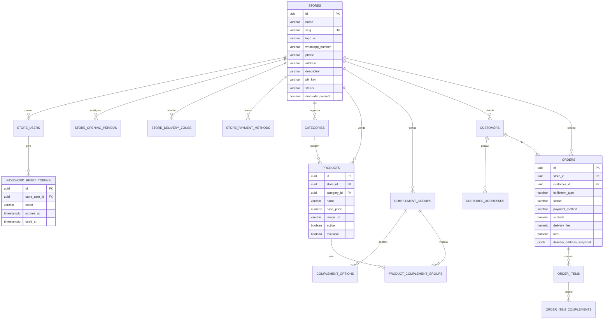

# MeVeUm API

Backend Spring Boot do MeVeUm. Este modulo concentra regras de negocio,
autenticacao, multi-tenancy por loja, migrations Flyway, persistencia em
PostgreSQL e contratos HTTP consumidos pelo frontend e pelas automacoes.

## Stack

| Tecnologia | Uso |
|---|---|
| Java 21 | Runtime da API |
| Spring Boot 4.0.6 | Framework principal |
| Spring Web MVC | Controllers HTTP |
| Spring Data JPA | Persistencia |
| Spring Security + OAuth2 Resource Server | JWT RSA |
| Spring Validation | Validacao de requests |
| Flyway | Evolucao do schema |
| PostgreSQL 16 | Banco local e CI |
| Lombok | Builders e boilerplate |
| SpringDoc OpenAPI 3.0.2 | Swagger |
| Testcontainers | Testes com PostgreSQL real |

## Como rodar

### 1. Banco

```bash
docker compose up -d
```

O compose sobe `postgres:16-alpine` com:

| Campo | Valor |
|---|---|
| Host | `127.0.0.1` |
| Porta | `5432` |
| Database | `meveum` |
| Usuario | `meveum` |
| Senha | `meveum` |
| Volume local | `api/data/postgres` |

### 2. API

Windows:

```powershell
.\mvnw.cmd spring-boot:run
```

Linux/macOS:

```bash
./mvnw spring-boot:run
```

URLs:

- API: `http://localhost:8080`
- Swagger UI: `http://localhost:8080/swagger-ui.html`
- OpenAPI: `http://localhost:8080/v3/api-docs`

### 3. Testes

Windows:

```powershell
.\mvnw.cmd clean test
```

Linux/macOS:

```bash
./mvnw clean test
```

Os testes usam Testcontainers quando precisam de PostgreSQL real. Services,
mappers e validators devem ter testes unitarios sempre que forem criados ou
alterados.

## Configuracao local

Arquivo principal: `src/main/resources/application.properties`.

Configuracao atual:

```properties
spring.datasource.url=jdbc:postgresql://127.0.0.1:5432/meveum
spring.datasource.username=meveum
spring.datasource.password=meveum
spring.jpa.hibernate.ddl-auto=validate
spring.flyway.enabled=true
spring.flyway.locations=classpath:db/migration
jwt.public.key=classpath:authz.pub
jwt.private.key=classpath:authz.pem
```

`ddl-auto=validate` e intencional: o Hibernate valida o schema, mas quem cria
ou altera tabelas e o Flyway.

## Arquitetura

A API e um monolito modular por dominio. O padrao de fluxo e:



Responsabilidades:

| Camada | Responsabilidade |
|---|---|
| Controller | Rotas, status HTTP, validacao de request com `@Valid` e chamada da service |
| Service | Caso de uso, orquestracao, transacao e regra de negocio |
| Validator | Validacoes puras ou validacoes com banco em `validator/service` |
| Mapper | Conversao explicita entre DTOs e entities |
| Repository | Acesso a dados e queries calculadas |
| Entity | Modelo persistido |
| DTO | Contrato HTTP especifico por funcionalidade |

Controllers nao devem conter regra de negocio. Services nao devem montar DTOs
manualmente se houver mapper do dominio. Repositories nao devem conter regra de
negocio.

## Dominios

```text
src/main/java/br/com/meveum/
|-- auth/                  Login, cadastro, JWT e recuperacao de senha
|-- lojas/                 Loja tenant, perfil, horarios e status operacional
|-- cardapio/
|   |-- categorias/        CRUD de categorias
|   |-- produtos/          CRUD, disponibilidade e remocao logica de produtos
|   |-- complementos/      Grupos, opcoes e vinculo produto-grupo
|   `-- entity|repository  Entidades compartilhadas do catalogo
|-- entrega/areas/         Areas e taxas de entrega
|-- pagamentos/formas/     Formas de pagamento aceitas pela loja
|-- crm/clientes/          Clientes e enderecos
|-- pedidos/               Criacao, listagem, detalhe e status de pedidos
|-- dashboard/             Resumo, grafico, KDS, rankings e clientes recorrentes
|-- integracao_whatsapp/   Mensagem estruturada do pedido
`-- shared/                Config, security e exception handler
```

## Endpoints por dominio

| Dominio | Rotas principais |
|---|---|
| Auth | `POST /auth/login`, `POST /auth/registrar`, `POST /auth/esqueci-senha`, `POST /auth/redefinir-senha`, `GET /auth/me` |
| Lojas | `GET /lojas/me`, `GET /lojas/{id}`, `GET /lojas/slug/{slug}`, `PUT /lojas/{id}`, `PATCH /lojas/{id}/pausa-manual`, `PATCH /lojas/{id}/status`, `GET/PUT /lojas/{id}/horarios` |
| Categorias | `POST /categorias`, `GET /categorias`, `GET/PUT/DELETE /categorias/{id}` |
| Produtos | `POST /produtos`, `GET /produtos`, `GET/PUT/DELETE /produtos/{id}`, `PATCH /produtos/{id}/toggle-disponivel` |
| Complementos | `POST/GET /complementos/grupos`, `GET/PUT/DELETE /complementos/grupos/{id}`, `POST/GET /complementos/opcoes`, `GET/PUT/DELETE /complementos/opcoes/{id}`, vinculos em `/complementos/produtos/{produtoId}/grupos` |
| Entrega | `POST /entrega/areas`, `GET /entrega/areas`, `GET/PUT/DELETE /entrega/areas/{id}` |
| Pagamentos | `POST /pagamentos/formas`, `GET /pagamentos/formas`, `GET/PUT/DELETE /pagamentos/formas/{id}` |
| Clientes | `POST /clientes`, `GET /clientes`, `GET/PUT /clientes/{id}`, enderecos em `/clientes/{id}/enderecos` |
| Pedidos | `POST /pedidos`, `GET /pedidos`, `GET /pedidos/{id}`, `PATCH /pedidos/{id}/status` |
| Dashboard | `GET /dashboard/resumo`, `/produtos-mais-vendidos`, `/grafico-semanal`, `/pedidos-resumo`, `/kds`, `/clientes-recorrentes` |
| WhatsApp | `GET /integracoes/whatsapp/pedidos/{pedidoId}/mensagem` |

## Banco de dados

### Estado atual

O banco esta versionado de `V1` a `V13` em
`src/main/resources/db/migration/`.

| Versao | Objetivo |
|---|---|
| `V1` | Schema inicial com lojas, catalogo, clientes e pedidos |
| `V2` | Loja e usuario de desenvolvimento |
| `V3` | Produto/categoria de desenvolvimento |
| `V4` | Complementos de desenvolvimento |
| `V5` | Area de entrega de desenvolvimento |
| `V6` | Forma de pagamento de desenvolvimento |
| `V7` | Cliente e endereco de desenvolvimento |
| `V8` | Pedido completo de desenvolvimento |
| `V9` | Usuario autenticavel para testes |
| `V10` | Vinculo do grupo de complemento ao produto de teste |
| `V11` | Tabela `password_reset_tokens` |
| `V12` | Campos de perfil da loja: `phone`, `address`, `description`, `pix_key` |
| `V13` | Campo `products.available` para disponibilidade operacional |

O schema atual tem 16 tabelas:

| Grupo | Tabelas |
|---|---|
| Loja e auth | `stores`, `store_users`, `password_reset_tokens` |
| Operacao | `store_opening_periods`, `store_delivery_zones`, `store_payment_methods` |
| Catalogo | `categories`, `products`, `complement_groups`, `complement_options`, `product_complement_groups` |
| CRM | `customers`, `customer_addresses` |
| Pedidos | `orders`, `order_items`, `order_item_complements` |

### Diagrama ER resumido



### Decisoes de modelagem

- `store_id` e a fronteira de tenant.
- Dados financeiros e indicadores do dashboard sao calculados por query; nao
  existem colunas agregadas como `saldo_total`.
- `orders` e itens salvam snapshot de produto/complemento para preservar o
  historico mesmo se o cardapio mudar.
- `products.active` representa remocao logica; `products.available` representa
  disponibilidade operacional.
- `stores.manually_paused` fecha temporariamente a loja sem alterar `status`.
- `password_reset_tokens` guarda ciclo de recuperacao de senha com expiracao e
  uso.

Documento completo do modelo: [`docs/database-model.md`](docs/database-model.md).

## Dados locais de desenvolvimento

As migrations `V2` a `V10` criam uma massa fixa para desenvolvimento local.
Os IDs estao documentados em [`dados/README.md`](dados/README.md).

Essa massa existe para facilitar Postman, Playwright e testes manuais. Para
testes automatizados novos, prefira factories/services criando dados dinamicos
quando o cenario exigir independencia.

## Dashboard e metricas

As metricas do dashboard sao derivadas de consultas:

- resumo: faturamento, pedidos, ticket medio e tempo medio de cozinha;
- grafico semanal: faturamento agregado por dia;
- produtos mais vendidos: ranking por quantidade/receita;
- pedidos resumo/KDS: recortes operacionais de pedidos recentes;
- clientes recorrentes: recorrencia e gasto calculados a partir de pedidos.

Regra importante: agregados devem ser calculados em query ou service a partir
do dado fonte. Nao criar coluna persistida de totalizador sem necessidade clara
de performance e sem plano de consistencia.

## Padroes de implementacao

Checklist para novo caso de uso:

1. Criar DTOs especificos de request/response.
2. Criar ou atualizar validator do dominio.
3. Criar service pequena, com nome de caso de uso.
4. Usar mapper para conversoes.
5. Usar repository apenas para acesso a dados.
6. Criar endpoint no controller sem regra de negocio.
7. Criar testes de service, mapper e validator.
8. Atualizar automacoes se o contrato HTTP mudou.

Padrao de nomes:

- `CriarProdutoService`
- `AtualizarStatusPedidoService`
- `DetalharMinhaLojaService`
- `ValidarProdutoExisteService`
- `ProdutoMapper`
- `CriarProdutoRequest`
- `CriarProdutoResponse`

## Qualidade e CI

Comandos principais:

```bash
./mvnw test
./mvnw clean test
./mvnw spring-boot:run
```

No CI, o job `API - testes` roda `./mvnw test`.

Antes de abrir PR que toca API:

- rode os testes da API;
- confira se migrations novas sobem do zero;
- confirme que DTOs/automacoes foram atualizados;
- nao commite `.env`, `target/`, dumps, logs ou dados locais.
