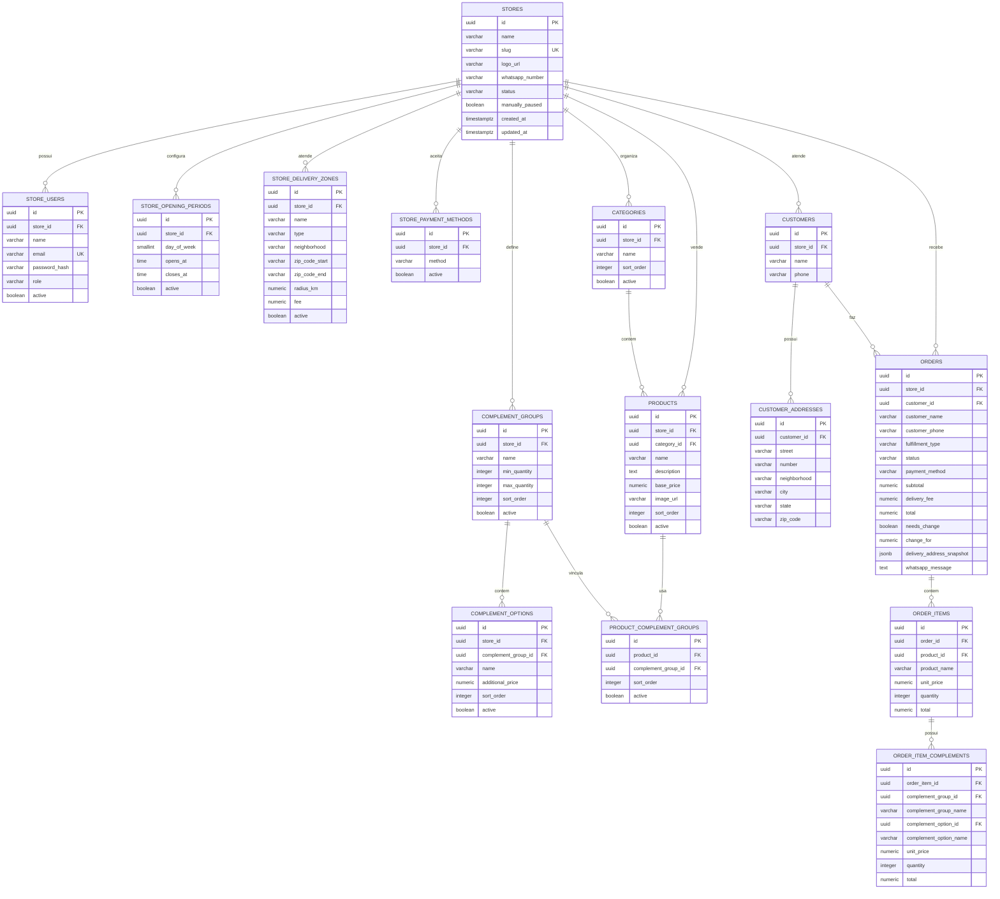

# Modelo de banco inicial - Meveum

Objetivo: suportar um cardapio digital e sistema de pedidos no estilo Anota Ai,
com multi-tenancy por loja, checkout via WhatsApp e painel de controle para o
lojista.

## Decisoes principais

- Cada loja e um tenant. Quase todas as tabelas de negocio carregam `store_id`.
- O slug da loja e unico e usado para carregar o cardapio publico.
- Produto, categoria e complementos usam `active` para esconder sem perder
  historico.
- Pedido salva snapshot de nome, preco e complementos, porque o cardapio pode
  mudar depois que o pedido foi feito.
- Horario de funcionamento aceita varios periodos por dia para permitir pausa
  entre almoco e jantar.
- Entrega comeca flexivel: bairro, faixa de CEP ou raio.
- Pagamento aceito pela loja fica separado da forma escolhida no pedido.

## Tabelas base

### stores

Representa o tenant/loja.

Campos principais:

- `id`
- `name`
- `slug`
- `logo_url`
- `whatsapp_number`
- `status`
- `manually_paused`
- `created_at`
- `updated_at`

Observacoes:

- `slug` deve ser unico.
- `status`: `ACTIVE`, `INACTIVE`.
- `manually_paused` atende o botao de pausa da loja.

### store_users

Usuarios administrativos da loja.

Campos principais:

- `id`
- `store_id`
- `name`
- `email`
- `password_hash`
- `role`
- `active`
- `created_at`
- `updated_at`

Observacoes:

- `email` deve ser unico globalmente no MVP.
- `role`: `OWNER`, `MANAGER`, `STAFF`.

### store_opening_periods

Periodos de funcionamento.

Campos principais:

- `id`
- `store_id`
- `day_of_week`
- `opens_at`
- `closes_at`
- `active`

Observacoes:

- `day_of_week`: 1 a 7, seguindo ISO: segunda=1, domingo=7.
- Permite mais de um periodo no mesmo dia.

### store_delivery_zones

Areas e taxas de entrega.

Campos principais:

- `id`
- `store_id`
- `name`
- `type`
- `neighborhood`
- `zip_code_start`
- `zip_code_end`
- `radius_km`
- `fee`
- `minimum_order_value`
- `estimated_minutes`
- `active`

Observacoes:

- `type`: `NEIGHBORHOOD`, `ZIP_RANGE`, `RADIUS`.
- Nem todos os campos sao obrigatorios para todos os tipos.

### store_payment_methods

Formas de pagamento aceitas pela loja.

Campos principais:

- `id`
- `store_id`
- `method`
- `active`

Observacoes:

- `method`: `PIX`, `CREDIT_CARD_DELIVERY`, `DEBIT_CARD_DELIVERY`, `CASH`.

## Catalogo

### categories

Categorias do cardapio.

Campos principais:

- `id`
- `store_id`
- `name`
- `description`
- `sort_order`
- `active`
- `created_at`
- `updated_at`

### products

Produtos do cardapio.

Campos principais:

- `id`
- `store_id`
- `category_id`
- `name`
- `description`
- `base_price`
- `image_url`
- `sort_order`
- `active`
- `created_at`
- `updated_at`

Observacoes:

- Produto pertence a uma categoria.
- `store_id` tambem fica no produto para consultas rapidas por loja.

### complement_groups

Grupos de complementos, como "Adicionais" ou "Escolha o ponto".

Campos principais:

- `id`
- `store_id`
- `name`
- `description`
- `min_quantity`
- `max_quantity`
- `sort_order`
- `active`
- `created_at`
- `updated_at`

Observacoes:

- `min_quantity > 0` torna o grupo obrigatorio.
- `max_quantity` controla limite de selecao.

### complement_options

Opcoes dentro de um grupo de complementos.

Campos principais:

- `id`
- `store_id`
- `complement_group_id`
- `name`
- `description`
- `additional_price`
- `sort_order`
- `active`

### product_complement_groups

Vinculo N:N entre produto e grupo de complemento.

Campos principais:

- `id`
- `product_id`
- `complement_group_id`
- `sort_order`
- `active`

Observacoes:

- Permite reutilizar o mesmo grupo em varios produtos.

## Checkout e pedidos

### customers

Cliente final. Pode ser simples no MVP.

Campos principais:

- `id`
- `store_id`
- `name`
- `phone`
- `created_at`
- `updated_at`

Observacoes:

- Mesmo telefone pode existir em lojas diferentes.

### customer_addresses

Enderecos salvos ou usados em pedidos.

Campos principais:

- `id`
- `customer_id`
- `label`
- `street`
- `number`
- `complement`
- `neighborhood`
- `city`
- `state`
- `zip_code`
- `reference`
- `latitude`
- `longitude`

### orders

Pedido gerado no checkout e usado no painel do lojista.

Campos principais:

- `id`
- `store_id`
- `customer_id`
- `customer_name`
- `customer_phone`
- `fulfillment_type`
- `status`
- `payment_method`
- `subtotal`
- `delivery_fee`
- `discount_total`
- `total`
- `needs_change`
- `change_for`
- `customer_note`
- `delivery_address_snapshot`
- `whatsapp_message`
- `created_at`
- `updated_at`

Observacoes:

- `fulfillment_type`: `DELIVERY`, `PICKUP`.
- `status`: `NEW`, `PREPARING`, `OUT_FOR_DELIVERY`, `DONE`, `CANCELED`.
- `delivery_address_snapshot` pode ser `jsonb` no PostgreSQL.
- `whatsapp_message` guarda o texto enviado/gerado para auditoria.

### order_items

Itens do pedido com snapshot do produto.

Campos principais:

- `id`
- `order_id`
- `product_id`
- `product_name`
- `unit_price`
- `quantity`
- `total`
- `note`

### order_item_complements

Complementos escolhidos em um item do pedido.

Campos principais:

- `id`
- `order_item_id`
- `complement_group_id`
- `complement_group_name`
- `complement_option_id`
- `complement_option_name`
- `unit_price`
- `quantity`
- `total`

## Modelo visual simplificado


```

## MVP recomendado

Comecar com:

- `stores`
- `store_users`
- `store_opening_periods`
- `store_delivery_zones`
- `store_payment_methods`
- `categories`
- `products`
- `complement_groups`
- `complement_options`
- `product_complement_groups`
- `customers`
- `customer_addresses`
- `orders`
- `order_items`
- `order_item_complements`

Deixar para depois:

- cupons/descontos avancados
- promocoes por horario
- estoque
- impressao de pedido
- integracao com pagamento online
- notificacoes reais por WhatsApp API
- multi-filial
- plano/assinatura da loja
