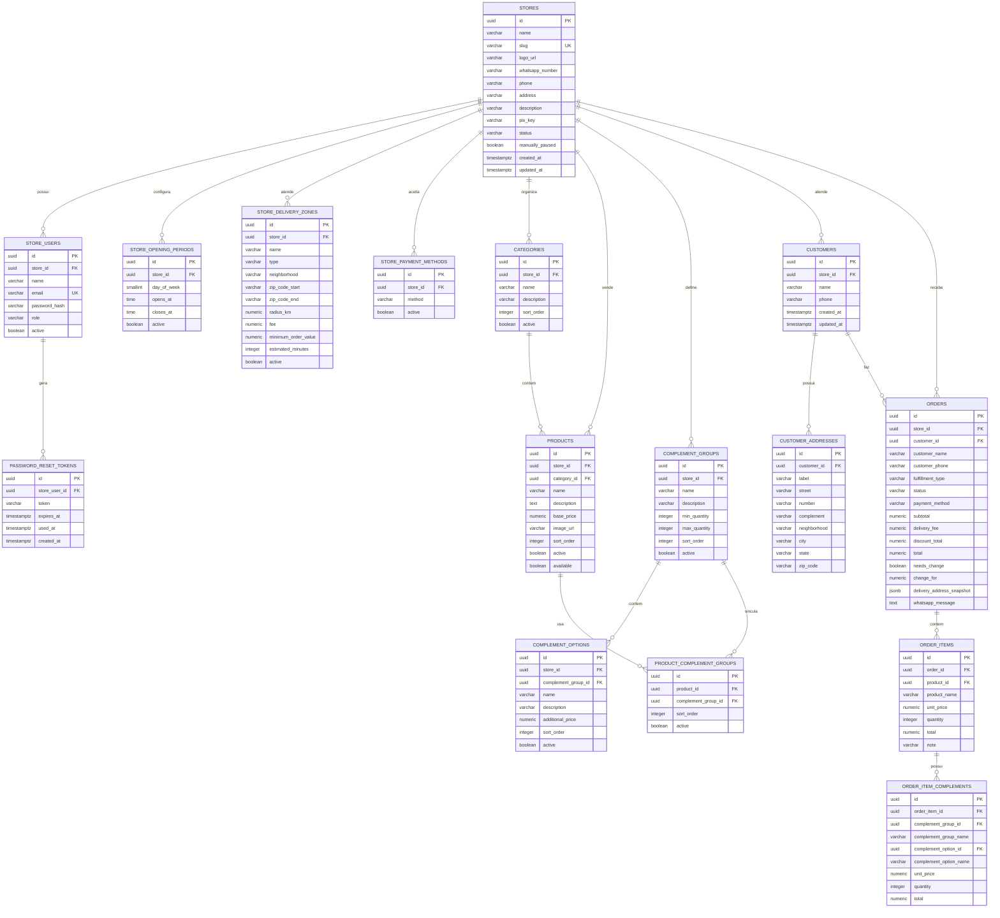

# Modelo de dados - MeVeUm

Modelo relacional atual da API, baseado nas migrations Flyway de
`V1__create_initial_schema.sql` a `V13__add_product_available_field.sql`.

## Principios

- Cada loja e um tenant; `store_id` separa os dados de negocio.
- O slug da loja carrega o cardapio publico.
- Catalogo usa remocao logica com `active`.
- Produto tem `available` separado de `active` para pausar venda sem excluir.
- Pedido salva snapshots de produto, complemento, endereco e mensagem para
  preservar historico.
- Agregados de dashboard sao calculados por query/service, nao persistidos em
  colunas totalizadoras.
- Flyway e a unica fonte de evolucao do schema; Hibernate roda em
  `ddl-auto=validate`.

## Historico de migrations

| Versao | Objetivo |
|---|---|
| `V1` | Cria schema inicial |
| `V2` | Insere loja e usuario base |
| `V3` | Insere categoria/produto base |
| `V4` | Insere complementos base |
| `V5` | Insere area de entrega |
| `V6` | Insere forma de pagamento |
| `V7` | Insere cliente/endereco |
| `V8` | Insere pedido completo |
| `V9` | Insere usuario autenticavel |
| `V10` | Vincula grupo de complemento ao produto |
| `V11` | Cria `password_reset_tokens` |
| `V12` | Adiciona `phone`, `address`, `description`, `pix_key` em `stores` |
| `V13` | Adiciona `available` em `products` |

## Tabelas

### Loja e autenticacao

| Tabela | Papel |
|---|---|
| `stores` | Tenant/loja, perfil publico e status operacional |
| `store_users` | Usuarios administrativos da loja |
| `password_reset_tokens` | Tokens de recuperacao de senha |

### Operacao da loja

| Tabela | Papel |
|---|---|
| `store_opening_periods` | Periodos de funcionamento por dia |
| `store_delivery_zones` | Areas, taxas, pedido minimo e prazo |
| `store_payment_methods` | Formas de pagamento aceitas |

### Catalogo

| Tabela | Papel |
|---|---|
| `categories` | Categorias do cardapio |
| `products` | Produtos e disponibilidade |
| `complement_groups` | Grupos de complementos |
| `complement_options` | Opcoes dentro dos grupos |
| `product_complement_groups` | Vinculo N:N entre produtos e grupos |

### CRM e pedidos

| Tabela | Papel |
|---|---|
| `customers` | Cliente final por loja |
| `customer_addresses` | Enderecos do cliente |
| `orders` | Pedido e snapshots principais |
| `order_items` | Itens do pedido com snapshot do produto |
| `order_item_complements` | Complementos escolhidos no item |

## Campos principais

### `stores`

- `id`
- `name`
- `slug`
- `logo_url`
- `whatsapp_number`
- `phone`
- `address`
- `description`
- `pix_key`
- `status`: `ACTIVE`, `INACTIVE`
- `manually_paused`
- `created_at`
- `updated_at`

### `store_users`

- `id`
- `store_id`
- `name`
- `email`
- `password_hash`
- `role`: `OWNER`, `MANAGER`, `STAFF`
- `active`
- `created_at`
- `updated_at`

### `password_reset_tokens`

- `id`
- `store_user_id`
- `token`
- `expires_at`
- `used_at`
- `created_at`

### `products`

- `id`
- `store_id`
- `category_id`
- `name`
- `description`
- `base_price`
- `image_url`
- `sort_order`
- `active`
- `available`
- `created_at`
- `updated_at`

### `orders`

- `id`
- `store_id`
- `customer_id`
- `customer_name`
- `customer_phone`
- `fulfillment_type`: `DELIVERY`, `PICKUP`
- `status`: `NEW`, `PREPARING`, `OUT_FOR_DELIVERY`, `DONE`, `CANCELED`
- `payment_method`: `PIX`, `CREDIT_CARD_DELIVERY`, `DEBIT_CARD_DELIVERY`, `CASH`
- `subtotal`
- `delivery_fee`
- `discount_total`
- `total`
- `needs_change`
- `change_for`
- `customer_note`
- `delivery_address_snapshot`
- `whatsapp_message`
- `created_at`
- `updated_at`

## Diagrama ER

## Indices e restricoes importantes

- `stores.slug` unico.
- `store_users.email` unico globalmente no MVP.
- `customers (store_id, phone)` unico.
- `store_payment_methods (store_id, method)` unico.
- `product_complement_groups (product_id, complement_group_id)` unico.
- Indices por `store_id`, `status`, `created_at`, `category_id`, `phone` e
  relacionamentos de pedido otimizam listagens e dashboard.

## Seeds de desenvolvimento

Os dados fixos estao documentados em [`../dados/README.md`](../dados/README.md).

Esses dados ajudam em Postman e testes manuais, mas automacoes novas devem criar
dados dinamicos quando precisarem de isolamento.
